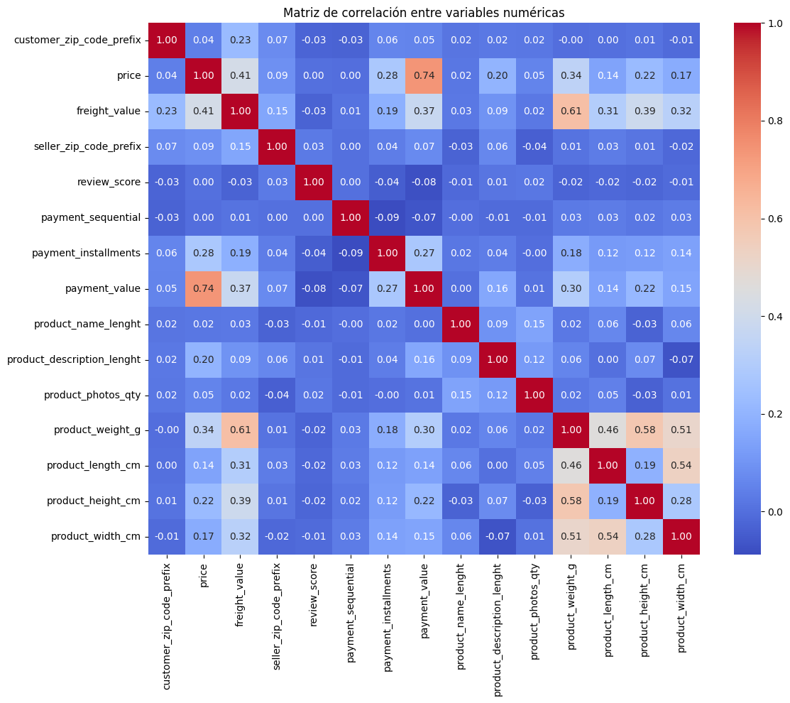
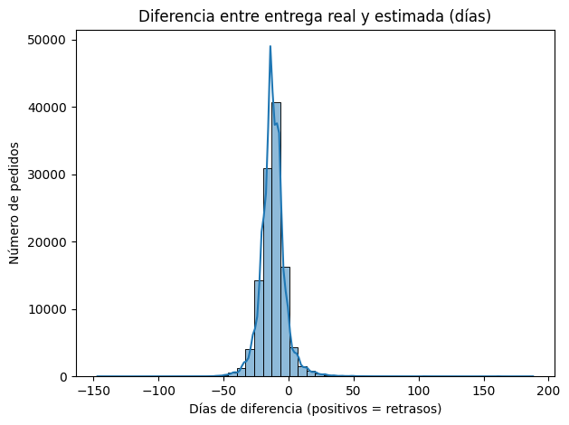
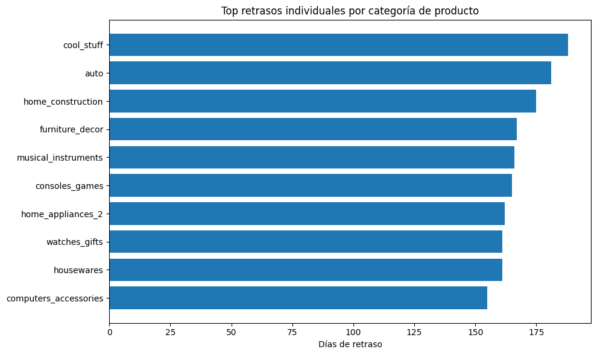
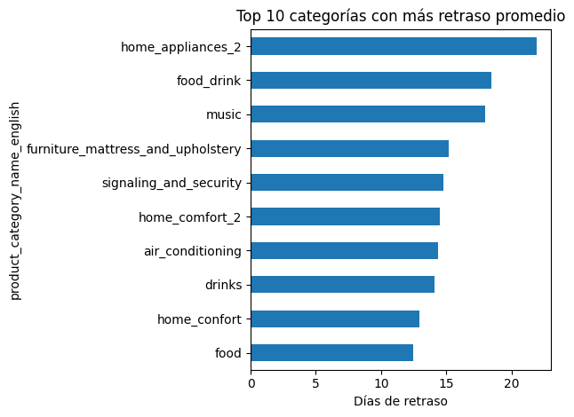

# Resultados

## Matriz de Correlación

  

### 1. **Correlaciones fuertes (mayores a ±0.6)**

| Variables                          | Correlación | Interpretación |
|------------------------------------|-------------|----------------|
| `price` vs `payment_value`         | **0.74**    | A mayor precio, mayor valor pagado. Relación lógica. |
| `freight_value` vs `product_weight_g` | **0.61** | Productos más pesados tienen mayores costos de envío. |
| `product_weight_g` vs `product_length_cm` | **0.58** | Peso y longitud del producto están fuertemente relacionados. |
| `product_weight_g` vs `product_width_cm`  | **0.51** | Lo mismo aplica con el ancho del producto. |
| `product_length_cm` vs `product_width_cm` | **0.54** | Dimensiones físicas relacionadas entre sí. |
| `product_height_cm` vs `product_weight_g` | **0.46** | Altura también correlaciona con peso. |

### 2. **Correlaciones medias (±0.3 a ±0.6)**

| Variables                             | Correlación | Interpretación |
|---------------------------------------|-------------|----------------|
| `freight_value` vs `price`            | **0.41**    | Productos más caros suelen tener mayor costo de envío. |
| `freight_value` vs `product_length_cm`| **0.31**    | Dimensiones influyen en el costo logístico. |
| `payment_installments` vs `payment_value` | **0.27** | A mayor valor pagado, mayor probabilidad de usar cuotas. |

### 3. **Correlaciones débiles o nulas**

La mayoría de las variables relacionadas con reseñas (`review_score`), cantidad de fotos, largo del nombre del producto, etc., **no presentan correlación significativa** con el resto. Por ejemplo:

- `review_score` tiene correlaciones muy cercanas a 0 con todas las variables.
- `product_photos_qty` no se relaciona ni con precio ni con dimensiones.

### 4. **Variables que podrían ser redundantes**

- `product_weight_g`, `product_length_cm`, `product_height_cm`, `product_width_cm` están **altamente correlacionadas entre sí**, lo cual indica que **pueden estar captando una misma dimensión física del producto**. Un paso importante sería poder unificar estas variables en un volumen para poder reducir dimensionaidad.

## Histograma de Días de Diferencia de Entrega de Productos

La distribución de la variable `delivery_diff_days`, es decir:

$$
\text{días de retraso} = \text{fecha entrega real} - \text{fecha estimada}
$$

- **Valores negativos** → la entrega fue anticipada.
- **Valor cero** → entrega puntual.
- **Valores positivos** → hubo **retraso**.

### Hallazgos relevantes

1. **Distribución centrada en 0**  
   La mayoría de los pedidos fueron entregados en un rango cercano a la fecha estimada, lo cual indica que **el sistema de estimación actual no es errático**.

2. **Sesgo negativo leve**  
   Hay una ligera **asimetría hacia la izquierda**, indicando que **hay más entregas anticipadas que retrasadas**, pero esto puede ser engañoso, se debe analizar los datos por regiones u otros factores como el tipo de producto o ciudad del vendedor.

3. **Retrasos extremos (colas largas a la derecha)**  
   Aunque la mayoría de entregas se concentran cerca del 0, se observan **retrasos importantes (hasta +150 días)**. Estas colas **son críticas para el modelo**, ya que indican **zonas de alta dificultad logística** que se deben estudiar.

4. **Entregas anticipadas anómalas**  
   Se ven valores muy negativos (hasta -150 días), lo cual puede reflejar:
   - Errores de captura de datos
   - Estimaciones artificialmente largas para cubrir márgenes de error
   - Pedidos cancelados o con fechas imputadas

### Implicaciones para el modelo

- Esta variable (`delivery_diff_days`) **puede ser tratada como variable objetivo** en modelos:
  - **Regresivos**: predecir días de retraso
  - **Clasificatorios**: clasificar como entrega anticipada, puntual o tardía

- El modelo podrá ayudar a:
  - **Detectar zonas de alto riesgo logístico**
  - **Mejorar las estimaciones de entrega**
  - **Predecir la dificultad logística** por cliente, producto o zona

## Comparativa entre Retrasos Promedio y Retrasos Individuales

En esta sección se comparan dos enfoques complementarios para analizar la variable `delivery_diff_days` (diferencia entre fecha real y estimada de entrega):

### 1. **Retrasos Promedio por Categoría**

Se calculó el promedio de días de retraso únicamente para aquellas entregas que llegaron **después de la fecha estimada**. El top 10 de categorías con mayor promedio incluye:

- `home_appliances_2`: 21.9 días
- `food_drink`: 18.5 días
- `music`: 18.0 días
- `furniture_mattress_and_upholstery`: 15.2 días
- … *(otros con promedio >12 días)*

**Interpretación**:  
Este enfoque permite identificar **categorías que sistemáticamente presentan problemas logísticos**, ya sea por tamaño, complejidad de entrega, tipo de producto o localización de vendedores.

### 2. **Retrasos Individuales Máximos por Categoría**

Se identificó el pedido con **mayor retraso individual** dentro de cada categoría. Los valores alcanzan hasta:

- `cool_stuff`: **+188 días de retraso**
- `auto`: 184 días
- `home_construction`: 176 días
- `furniture_decor`: 169 días
- … *(todos con más de 150 días de retraso)*

**Interpretación**:  
Este análisis revela **outliers o casos extremos**, útiles para estudios de calidad del servicio, detección de anomalías o errores sistémicos puntuales.
