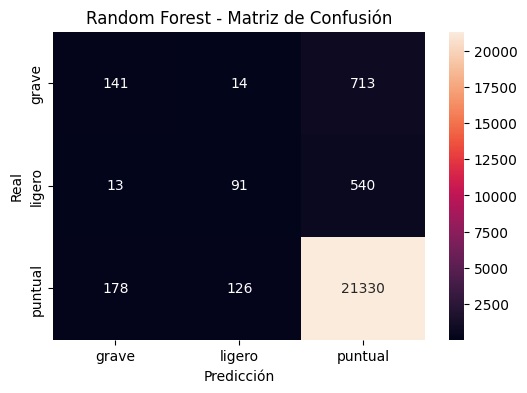
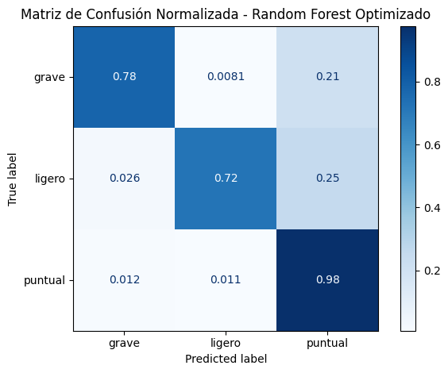
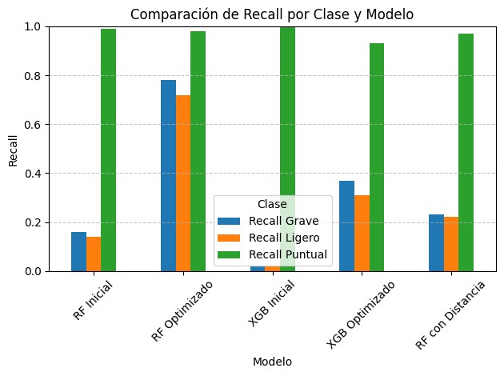

# Análisis Predictivo de Dificultad Logística en Entregas – Olist

## Objetivo

El propósito de este análisis fue desarrollar un modelo capaz de predecir la **dificultad logística de una entrega** realizada a través de Olist, con base en la diferencia entre la **fecha estimada y real de entrega**, considerando variables como **distancia**, **peso del producto**, y otras características logísticas relevantes.

El objetivo principal fue **clasificar** las entregas en tres categorías: `puntual`, `ligero retraso` y `grave retraso`, con el fin de **optimizar la planificación**, **reducir costos** y **mejorar la experiencia del cliente**.

## 1. Distribución de Clases

Inicialmente, los datos presentaban un desbalance marcado entre las clases:

| Clase   | Cantidad |
| ------- | -------- |
| Puntual | 108,171  |
| Grave   | 4,337    |
| Ligero  | 3,222    |

## 2. Primeros Resultados - Modelos Iniciales

Se entrenaron dos modelos: **Random Forest** y **XGBoost**, sin aplicar técnicas de balanceo ni optimización de hiperparámetros.

### Métricas de Desempeño

**Random Forest:**

* Accuracy: 93%
* Recall clase puntual: 99%
* Recall clase grave: 16%
* F1 Macro: 0.47

**XGBoost:**

* Accuracy: 94%
* Recall clase puntual: 100%
* Recall clase grave: 2%
* F1 Macro: 0.35

Ambos modelos muestran un fuerte sesgo hacia la clase mayoritaria (`puntual`).

### Matriz de Confusión



## 3. Optimización del Modelo - Random Forest

### Técnicas Aplicadas

* **Balanceo con SMOTE** para igualar la distribución de clases.
* **Asignación de pesos** para compensar el desbalance.
* **GridSearchCV** para optimización de hiperparámetros.

### Mejores Parámetros Encontrados

```json
{
  "n_estimators": 200,
  "max_depth": null,
  "min_samples_split": 2
}
```

### Resultados

* Accuracy: 96%
* Recall clase grave: 78%
* Recall clase ligero: 72%
* F1 Macro: 0.80



## 4. Comparación con XGBoost Optimizado

* F1 Macro: 0.50
* Recall clase grave: 37%
* Recall clase ligero: 31%
* Puntual se predice con precisión, pero el modelo sigue fallando en clases minoritarias.

## 5. Validación Cruzada y Métricas Finales (Random Forest)

* **F1 Macro CV (5-fold):** 0.39
* **ROC AUC macro:** 0.87
* Modelo generaliza bien, pero aún se enfrenta a ligeras limitaciones con clases minoritarias.

## 6. Inclusión de Distancia Geográfica

Se incluyó la variable `distancia_km` calculada entre vendedor y cliente, basada en coordenadas geográficas promedio por código postal.

### Resultados del modelo con distancia

| Clase   | Precision | Recall | F1-score |
| ------- | --------- | ------ | -------- |
| Grave   | 0.30      | 0.23   | 0.26     |
| Ligero  | 0.31      | 0.22   | 0.26     |
| Puntual | 0.95      | 0.97   | 0.96     |

* **Accuracy global:** 92%
* **F1 Macro:** 0.49

Aunque la precisión general se mantiene alta, la inclusión de distancia no mejoró significativamente la predicción de retrasos.

* **Random Forest**, tras balanceo y optimización, superó significativamente a XGBoost para este problema.
* La clase `puntual` se predice con excelente precisión.
* Las clases `grave` y `ligero` mejoraron considerablemente con SMOTE y GridSearchCV.
* La distancia geográfica no aportó una mejora notable, indicando que otros factores pueden influir más directamente en la dificultad logística.

## 7. Análisis Comparativo del Recall por Clase y Modelo

El gráfico de comparación de recall por clase permite evaluar la capacidad de cada modelo para identificar correctamente cada tipo de entrega (`grave`, `ligero`, `puntual`).



**Clase puntual:**
Todos los modelos alcanzan valores altos de recall, superiores al 90 %, lo que refleja una buena capacidad para predecir entregas a tiempo. Esto se debe principalmente al desbalance de clases, ya que la mayoría de los casos pertenecen a esta categoría.

**Clases grave y ligero:**
Los modelos iniciales (Random Forest y XGBoost) muestran un desempeño muy bajo en la identificación de retrasos. XGBoost, en particular, casi no logra detectar estas clases.
El modelo Random Forest optimizado es el único que logra un alto recall en ambas clases (`grave`: 0.78, `ligero`: 0.72), gracias al uso de SMOTE, ponderación de clases y ajuste de hiperparámetros.

XGBoost optimizado mejora respecto a su versión inicial, pero sigue por debajo de Random Forest.
El modelo Random Forest con distancia no mejora los resultados respecto al modelo optimizado sin esta variable. De hecho, el rendimiento disminuye ligeramente para las clases `grave` y `ligero`, lo que sugiere que la distancia geográfica no aporta valor predictivo relevante en este contexto.

**Conclusión:**
Random Forest optimizado es el modelo más equilibrado, ya que logra identificar correctamente tanto entregas puntuales como casos de retraso. Los demás modelos tienden a favorecer la clase mayoritaria y presentan dificultades en la clasificación de retrasos.
